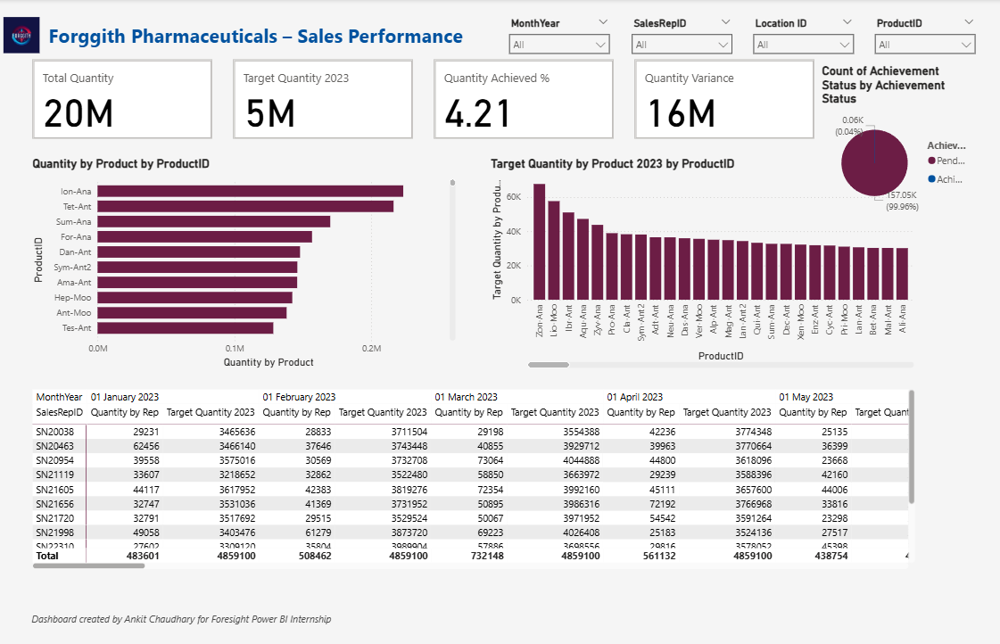
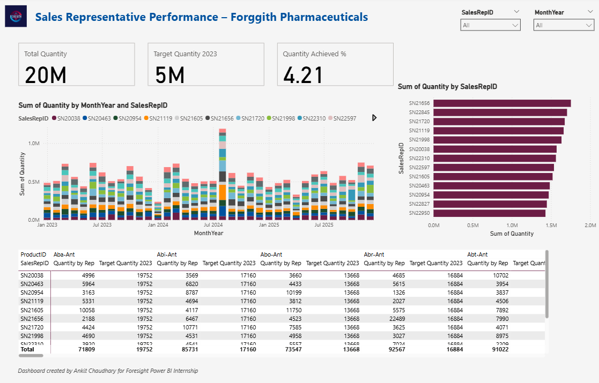
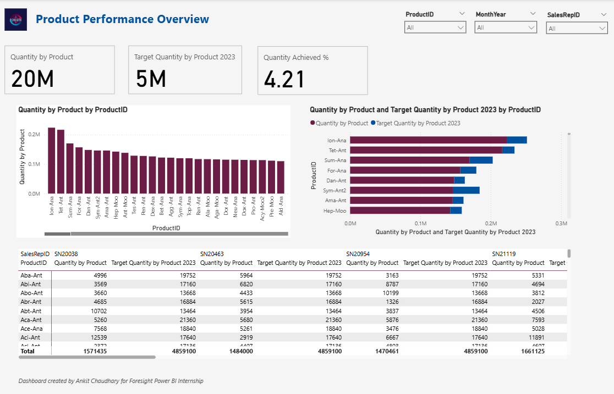
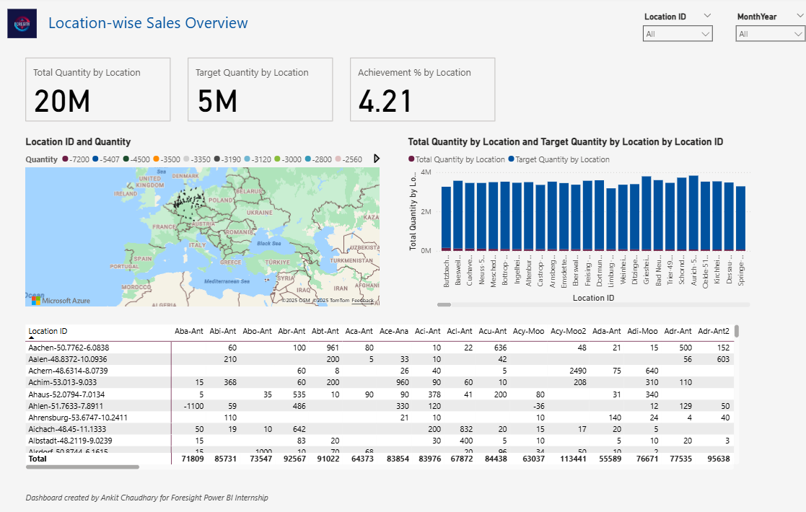

# 💊 Forggith Pharmaceuticals – Power BI Internship Dashboard

This Power BI report was developed as part of the **Power BI Developer Internship** at **ForesightBI**.  
It visualizes the **sales performance**, **product analysis**, **rep tracking**, and **location-based insights** for Forggith Pharmaceuticals.

> 📅 Duration: August 2025 Internship  
> 👨‍💻 Created by: Ankit Chaudhary

---

## 📊 Dashboard Overview (4 Pages)

### 🔹 **Page 1: Sales Overview**
- 🎯 Total Quantity vs Target
- 📈 Monthly Trends
- 🧩 Product-wise Sales
- 📌 Achievement % and Variance
- 📍 Pie Chart: Achieved vs Pending
- 📅 Slicers: Month, Location, Product, Sales Rep

---

### 🔹 **Page 2: Sales Representative Overview**
- 👤 Sales Rep-wise Revenue & Volume
- ✅ Target Achievement %
- 🔄 Product-wise breakdown per Rep
- 📊 Stacked Charts & Matrix

---

### 🔹 **Page 3: Product Performance Overview**
- 💊 Quantity vs Target per Product
- 📈 Trends across Products and Reps
- 📅 Slicers: Product, SalesRepID, Month
- 📋 Matrix and KPI cards

---

### 🔹 **Page 4: Location Performance Overview**
- 🗺️ Filled Map (Location vs Quantity)
- 🏢 Location-wise Product Matrix
- 📊 Target vs Actual by Region
- 📌 KPI cards: Quantity, Target, % Achieved

---

## 📁 Project Files & Structure

```plaintext
Forggith_Pharmaceutical_Dashboard/
├── Forggith Pharmaceuticals.pbix           ← Main Power BI file
├── Forggith_Pharmaceutials_Report.pdf         ← Exported PDF
├── README.md                         ← This file
├── Assets/
│   ├── Logo-230519-113445.png
│   └── Theme Colors.xlsx
├── Dataset/
│   ├── PharmDataset-230517-152700.xlsx
│   └── PharmTargets-230519-175734.xlsx
└── Forggith Report Link.docx

```

---

## 📈 **Skills Demonstrated**
- ✅ Data Modeling in Power BI
- 📐 DAX Measures (KPIs, Variance, YTD)
- 🎨 Custom Theming & Visual Layout
- 🎛️ Slicers & Interactivity
- 📊 Charts: Bar, Column, Pie, Map, Matrix
- 🧠 Problem Solving & Design Thinking

---

## 🖼️ **Dashboard Page Previews**

### 1️⃣ **Sales Overview**


---

### 2️⃣ **Sales Rep Overview**


---

### 3️⃣ **Product Performance Overview**


---

### 4️⃣ **Location Performance Overview**


---

## 🌐 **Power BI Web Report Link**
https://app.powerbi.com/view?r=eyJrIjoiNDdmOGYyOGQtOTk2Ny00MDE4LWIwYTItOGVkMDUzYTQ5ZmIxIiwidCI6IjlmNTJhMTk0LTU5MDMtNGIzOS1hNTM0LTA4NzMwZGIxY2IyYiJ9

---

## ⚠️ **Disclaimer**
This project was built for educational and internship purposes only.                                                                                            All data is used solely for dashboard development practice.

---
